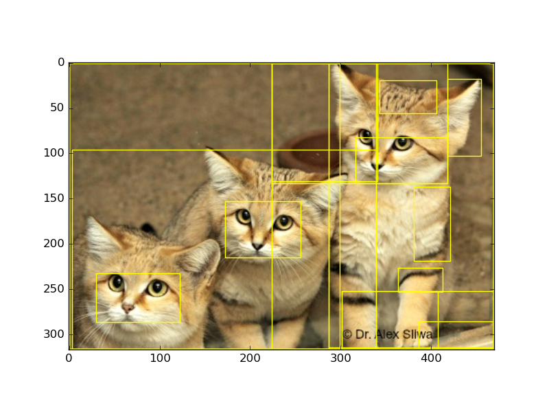

# Selectivesearch
Python wrapper for Selectivesearch image segmentation originally written by matconvnet team (https://github.com/jamt9000/matconvnet/blob/selectivesearch/COPYING)
Allows perform basic color/texture/size segmentation for consecutive classification.


## Usage
``` python
import selectivesearch
from selectivesearch.helpers import visualize_regions
import numpy as np
from PIL import Image
a= Image.open('./2016-sand-cat-group.jpg', 'r')
rgb_im = a.convert('RGB')
img = np.array(rgb_im)
img = img.astype('float32') / 255
print(img.shape)
rects = set(selectivesearch.selectivesearch(img, min_size=300, threshold=1000))
visualize_regions(img, rects)
```

Expects normalized RGB image with float data. Returns list of tuples ```(ay,ax,by,bx)``` with rectangle coordinates
 
## Installation
1). Make sure that OpenCV libs are installed
2). Execute
```
python setup.py install
```


